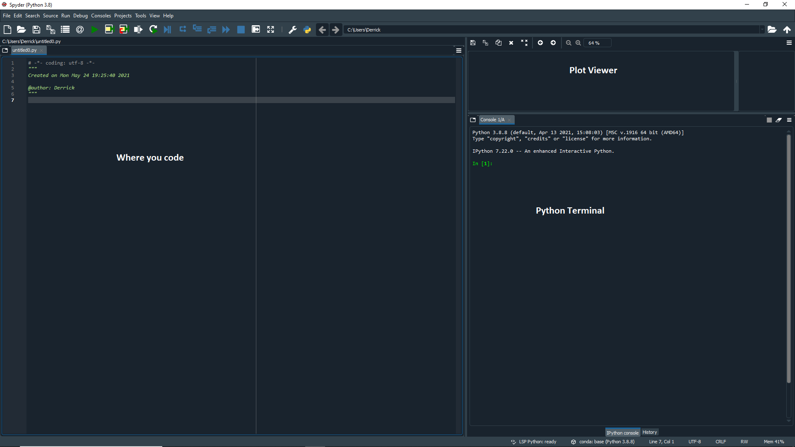

# Python Basic Data Analysis Tutorial

To learn to load, manipulate, and plot data, complete the following tutorial.

The tutorial assumes you will use the graphical Spyder interface in the Anaconda distribution of python, and explains how to install Anaconda. If you want to use Python in a terminal instead, look at these [alternative instructions and commands](https://github.com/capprogram/2017bootcamp-general/blob/master/ipython-terminal.md) for use with ipython on the linux command line. 

Here is a one page [Quick Reference](http://user.physics.unc.edu/~sheila/PythonQuickReference.pdf) for the commands used in this tutorial.

## Part I: Installation of Anaconda

See installation instructions for your [personal laptop](https://github.com/capprogram/2017bootcamp-general/blob/master/python-setup-laptop.md) or a [department workstation](https://github.com/capprogram/2017bootcamp-general/blob/master/python-setup-linux.md). Make sure to install Python 3.0 or higher. 

## Part II: Getting Started and Recording Your Work

After installing Anaconda, search for anaconda on your computer and open up the anaconda navigator app which will have a nice user interface. Then, find the "Spyder" app. 



The first thing to note is how the Spyder app is organized. The application includes multiple separate windows that each have different purposes (see image above). You can change which windows you prefer to have open from the `View -> Panes` and `View -> Toolbars` option. The default configuration has the Editor, Plotter, and Console/History log/IPython console windows open as shown above. I personally find that the variable explorer is better than the plots, so I would consider switching to that. 

You may want to change the default way graphs are plotted from a static inline image to an interactive window that you can resize/pan/zoom etc. To set this under `Tools -> Preferences`, select `IPython console` from the sidebar, go to the `Graphics` tab, and set the backend as `Automatic`.

The IPython console is where python is waiting for you to type commands, which tell it to load data, do math, plot data, etc. After every command, which looks like `In[1]: command`, you need to hit the enter key (return key), and then python may or may not give some output. The Editor allows you to write sequences of commands, which together make up a program. The History Log stores the last 100 commands you've typed into the Console. The top-right block (which I currently set to variable explorer) is purely informational -- if you watch what the first two display as we go through the tutorial, you'll see that they can be quite helpful.

### Entering Data
Type `x=5` in the Console -- this is the command to create a variable named x and give it the value 5. If you look at the `Variable explorer` tab you will see that x has been added to the list of variables in python's memory. You can also type `print x` or even just `x` in the Console to see the value of x. Now type `y=4` and then `x+y`. Notice that this last command does not create a variable, although it does produce an output from the calculation.

### Arrow Keys
If you use the arrow keys in the Console, you can bring back a previous command so that you can edit and re-execute it. Go back to the command `x+y` and change it to `junk=x+y`. You've now created the variable `junk`. What can you type to see its value in the Console?

### Arrays
Python can work with arrays of numbers, such as columns of data or tables of data (rows and columns). However, by default it is set up to handle lists of any kind of data -- perhaps names or addresses, not just numbers -- so we have to use the `array` function from Numpy (numerical python) to tell python that a given set of numbers should be treated as a numerical array. Before we do this, we need to learn the syntax for calling functions from a library.

#### Interlude on Libraries

Behind the scenes, Anaconda installs the libraries numpy, scipy, and matplotlib as well as many others to give you access to thousands of special functions. Every time you want to call one of these functions, you must first type the name of the library, followed by the name of the function like so `library.function`. Furthermore, the library must have been "imported" before you type this command, often under a nickname for convenience (you don't have to type the whole name out everytime). The standard imports and nicknames will be using are:

```python
import numpy as np		# basic numerical analysis
import matplotlib.pyplot as plt	# plotting
import scipy as sp		# extended scientific function
import scipy.stats as stats	# statistical functions
import numpy.random as npr	# random number generation
import astropy as ap		# core astronomy library
import astroML as ml		# machine learning for astronomy
import astroML.datasets as mld 	# datasets
import pymc			# bayesian methods including markov chain monte carlo
```

For the purposes of this tutorial we will only use numpy, the basic numerical analysis library, so you only need to type

```python
import numpy as np
import matplotlib.pyplot as plt
```
#### Interlude on Comments 

The `#` signs and the text after them indicate comments explaining what these commands do. Comments are ignored by python and not executed. They are very useful for reminding yourself what a program is actually doing when you go back to look at it a few months after writing it.

Now back to arrays. We wish to create a numerical array, as opposed to a list of numbers. To see how these differ, first type

```python
x=np.array([1,2,3,4])
y=np.array([4,0,3,2])
z=x+y
print z
```

and look at how these variables appear in the Variable explorer. Now type

```python
x=[1,2,3,4]
y=[4,0,3,2]
z=x+y
print z
```
and compare. For present purposes, we are *not* interested in the `list` behavior of the second set of commands, but only the `array` behavior of the first set. It's also worth noting that python happily overwrites x, y, and z with no error message, even when it means changing their variable types -- this behavior is different from that of programming languages that declare variables.

When working with real data, we may have both rows and columns. For example, define `x=np.array([[1, 3] , [2, 4], [10, 11]])`. The brackets within brackets imply 3 rows and 2 columns.

If you want to pick out one or more rows/columns in the array, you must use "indices" (a.k.a. "subscripts") to identify the portion of the array you want -- rows first, columns second, in square brackets. Both are numbered starting from zero. The colon `:` indicates a range, with two odd features -- first, `x:y` actually means index numbers from x to (y-1), and second, `:` by itself means all index numbers. For example, compare the results of `out1=x[1:2,1:2]` with the result of `out2=x[0,:]`. In the first example the colon acts like a dash specifying a range, i.e., read `1:2` as `1 to (2-1)` which is `1 to 1` or just the single index 1. The first command says you want out1 to be restricted to row \#1 (the second row) and column \#1 (the second column) of `x`, while the second says you want out2 to equal row 0 (the first row) of `x` with all columns. We refer to each number in an array as an **element**. Try to write a command to select the element of `x` in the second row, first column, and assign it to `y`.

### Special Arrays

Numpy's `arange` function can be used to generate a series of numbers, either in +1 increments (the default) or in increments you specify. Compare the output of `x1=np.arange(1,5)` and `x2=np.arange(1,5,2)`. The final number is the increment, unless it's missing, in which case it's assumed to be 1. The first two numbers are the starting and ending points, but once again python stops one increment before the ending point, just as for subscript ranges.

The `zeros` command can also be useful to make arrays you want to fill in with nonzero values later. For example, type `newarray=np.zeros([4,3])` and `x1=np.arange(1,5)`. Examine these variables dimensions under the "Size" column in the Variable explorer, or type `newarray.shape` and `x1.shape` to output their dimensions. Now type `newarray[:,1]=x1`. Examine the result carefully -- why was it necessary to use subscripts on newarray before inserting x1? Try `z=newarray+x1`. It gives an error -- why?

### Simple Math
Although python can do advanced math, we won't need that, so you should just remember a few simple operators and functions:

    + addition
    - subtraction
    * multiplication
    / division
    ** to-the-power-of
    e times 10-to-the (e.g. 2.e4 = 2. * 10^4)
    abs() absolute value
    sqrt() square root
    exp() e^
    log() natural log or ln
    log10() ordinary log (opposite of 10^)
    sin() sine of angle in radians
    cos() cosine of angle in radians

Note that the operators listed above do math `element-wise`, meaning if you, e.g., multiply two single column arrays, the two first elements will multiply, the two second elements will multiply, the two third elements will multiply, etc. Unlike matlab, python does *not* treat `*` as matrix multiplication for arrays, rather as simple element-wise multiplication.

Now using parentheses and simple math, you can create your own functions. For example, suppose you'd like to define a column of data (one-dimensional array) that obeys the equation c=lambda*nu over a range of lambda from 300-700nm going up by 50nm at a time. You can type `lam=300.+np.arange(0,401,50)` first, then `nu=3.e17 / lam` (where the speed of light is 3 x 10^17 in units of nm/sec). The output should be nu in Hertz (1/sec). Notice that although the `300.` was a scalar, python allows you to add it to an array (all elements) and does not complain about size mismatch. Warning: don't try to use the variable name `lambda` instead of `lam`! The word `lambda` has a special meaning in the python programming language, which we don't need to get into.

*Use parentheses liberally!* It is very easy to do different math than you intend. Notice that `nu=3.e17 / 300.+np.arange(0,401,50)` does not work properly, although you could write `nu=3.e17 / (300.+np.arange(0,401,50))`.
