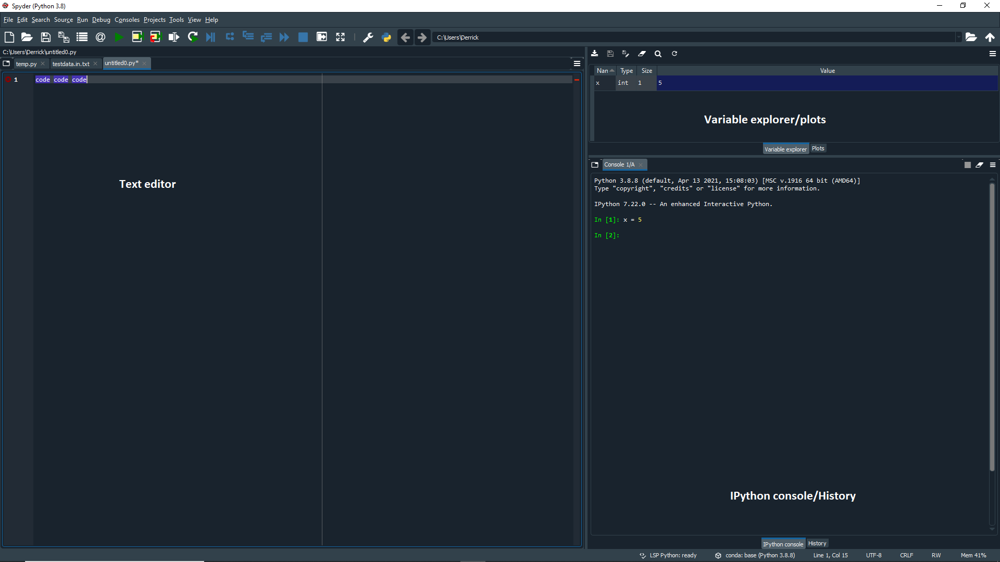

# Python Basic Data Analysis Tutorial

To learn to load, manipulate, and plot data, complete the following tutorial.

The tutorial assumes you will use the graphical Spyder interface in the Anaconda distribution of python, and explains how to install Anaconda. If you want to use Python in a terminal instead, look at these [alternative instructions and commands](https://github.com/capprogram/2017bootcamp-general/blob/master/ipython-terminal.md) for use with ipython on the linux command line. 

Here is a one page [Quick Reference](http://user.physics.unc.edu/~sheila/PythonQuickReference.pdf) for the commands used in this tutorial.

## Part I: Installation of Anaconda

See installation instructions for your [personal laptop](https://github.com/capprogram/2017bootcamp-general/blob/master/python-setup-laptop.md) or a [department workstation](https://github.com/capprogram/2017bootcamp-general/blob/master/python-setup-linux.md). Make sure to install Python 3.0 or higher. 

## Part II: Getting Started and Recording Your Work

After installing Anaconda, search for anaconda on your computer and open up the anaconda navigator app which will have a nice user interface. Then, find the "Spyder" app. 



The first thing to note is how the Spyder app is organized. The application includes multiple separate windows that each have different purposes (see image above). You can change which windows you prefer to have open from the `View -> Panes` and `View -> Toolbars` option. The default configuration has the Editor, Plotter, and Console/History log/IPython console windows open as shown above. I personally find that the variable explorer is better than the plots, so I would consider switching to that. 

You may want to change the default way graphs are plotted from a static inline image to an interactive window that you can resize/pan/zoom etc. To set this under `Tools -> Preferences`, select `IPython console` from the sidebar, go to the `Graphics` tab, and set the backend as `Automatic`.

The IPython console is where python is waiting for you to type commands, which tell it to load data, do math, plot data, etc. After every command, which looks like `In[1]: command`, you need to hit the enter key (return key), and then python may or may not give some output. The Editor allows you to write sequences of commands, which together make up a program. The History Log stores the last 100 commands you've typed into the Console. The top-right block (which I currently set to variable explorer) is purely informational -- if you watch what the first two display as we go through the tutorial, you'll see that they can be quite helpful.

### Entering Data
Type `x=5` in the Console -- this is the command to create a variable named x and give it the value 5. If you look at the `Variable explorer` tab you will see that x has been added to the list of variables in python's memory. You can also type `print x` or even just `x` in the Console to see the value of x. Now type `y=4` and then `x+y`. Notice that this last command does not create a variable, although it does produce an output from the calculation.

### Arrow Keys
If you use the arrow keys in the Console, you can bring back a previous command so that you can edit and re-execute it. Go back to the command `x+y` and change it to `junk=x+y`. You've now created the variable `junk`. What can you type to see its value in the Console?

### Arrays
Python can work with arrays of numbers, such as columns of data or tables of data (rows and columns). However, by default it is set up to handle lists of any kind of data -- perhaps names or addresses, not just numbers -- so we have to use the `array` function from Numpy (numerical python) to tell python that a given set of numbers should be treated as a numerical array. Before we do this, we need to learn the syntax for calling functions from a library.

#### Interlude on Libraries

Behind the scenes, Anaconda installs the libraries numpy, scipy, and matplotlib as well as many others to give you access to thousands of special functions. Every time you want to call one of these functions, you must first type the name of the library, followed by the name of the function like so `library.function`. Furthermore, the library must have been "imported" before you type this command, often under a nickname for convenience (you don't have to type the whole name out everytime). The standard imports and nicknames will be using are:

```python
import numpy as np		# basic numerical analysis
import matplotlib.pyplot as plt	# plotting
import scipy as sp		# extended scientific function
import scipy.stats as stats	# statistical functions
import numpy.random as npr	# random number generation
import astropy as ap		# core astronomy library
import astroML as ml		# machine learning for astronomy
import astroML.datasets as mld 	# datasets
import pymc			# bayesian methods including markov chain monte carlo
```
